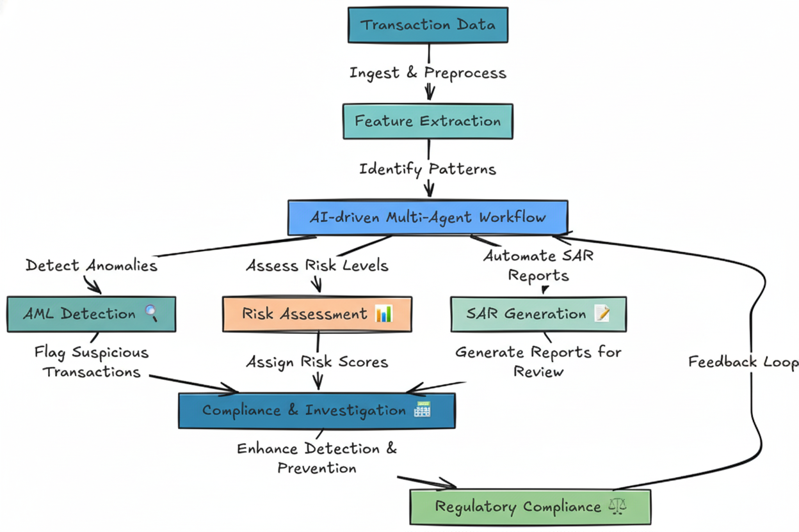
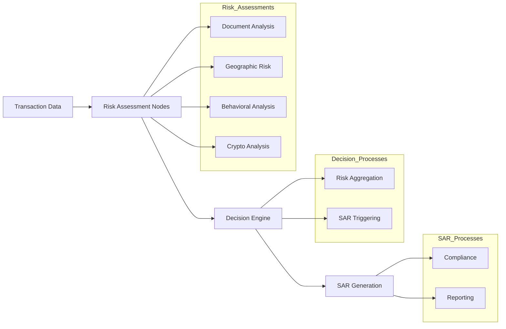
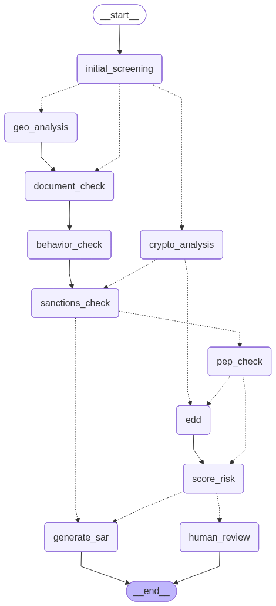
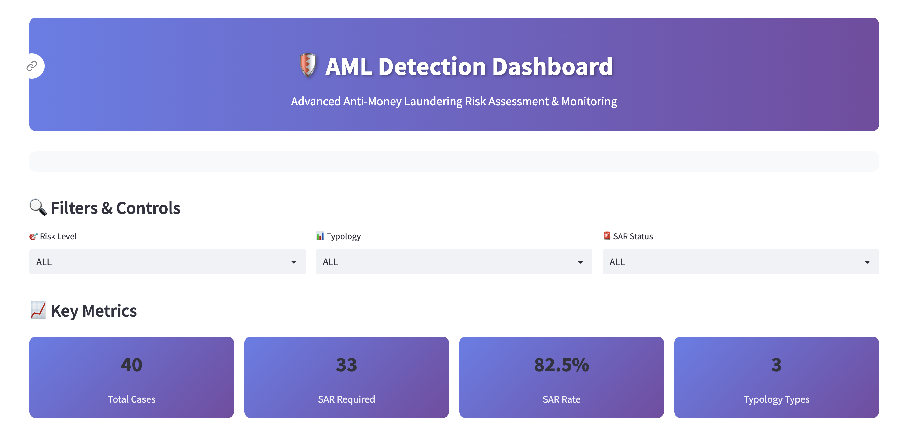
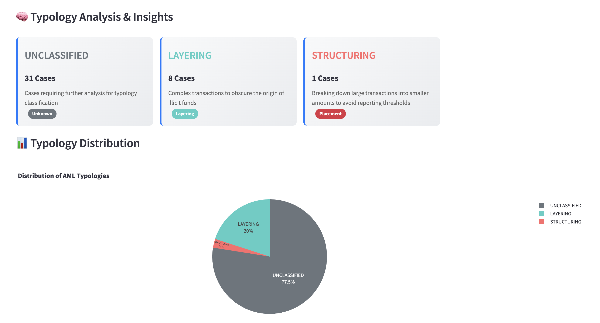

# 🛡️ AI-Powered Anti-Money Laundering Detection System

## Capstone Project Objective

The goal of this capstone project is to develop an advanced AI-powered Anti-Money Laundering (AML) detection system that can effectively identify and assess complex suspicious activities in financial transactions. The overall objective is to deliver a robust, scalable, and transparent solution leveraging state-of-the-art AI technologies and workflow orchestration to enhance AML processes within financial institutions. The intended outcome is a system capable of real-time detection, dynamic risk assessment, automated regulatory reporting, and comprehensive audit trails, ultimately supporting financial professionals in meeting compliance standards and proactively combating money laundering threats.

### 📚 Project Instructions

For detailed step-by-step instructions, please refer to the comprehensive **Capstone Project Instructions** document:

**[📖 AML_CAPSTONE_INSTRUCTIONS.md](AML_CAPSTONE_INSTRUCTIONS.md)**

This document contains:
- **Complete Project Phases**: 7 detailed phases with specific tasks and deliverables
- **Learning Outcomes**: Clear objectives for each phase
- **Implementation Guidance**: Step-by-step instructions with hints and tips
- **Evaluation Criteria**: Detailed marking scheme and assessment framework
- **Troubleshooting**: Common issues and solutions
- **Resource Links**: Documentation and learning resources

**Quick Start**: Begin with Phase 1 (Setup & Orientation) and follow the instructions sequentially through Phase 7 (Reporting & Dashboard).

### 📊 Project Phases Overview

The capstone project is structured into **7 comprehensive phases**:

| Phase | Focus Area | Duration | Marks | Key Deliverables |
|-------|------------|----------|-------|------------------|
| **Phase 1** | Setup & Orientation | ~1 hour | 10 | Environment setup, API keys, connectivity |
| **Phase 2** | Graph & State Design | ~1.5 hours | 15 | AMLState definition, graph structure |
| **Phase 3** | Risk Logic Implementation | ~2 hours | 20 | LLM-powered risk analysis nodes |
| **Phase 4** | Dynamic Routing & Decision Logic | ~1.5 hours | 15 | Risk aggregation, conditional routing |
| **Phase 5** | Langfuse Integration | ~2 hours | 15 | Observability and experiment tracking |
| **Phase 6** | Evaluation & Scoring | ~2 hours | 15 | Performance evaluation and metrics |
| **Phase 7** | Reporting & Dashboard | ~1.5 hours | 10 | SAR generation, typology classification |

**Total Marks: 100**

## 🎯 Problem Statement

The global financial ecosystem is under constant threat from highly sophisticated and evolving money laundering activities. Criminals now exploit advanced technologies and intricate financial channels to conceal the origins of illicit funds, making detection increasingly challenging. Traditional rule-based systems and manual review processes used by financial institutions are often inadequate at identifying complex schemes that span international borders, leverage digital assets, and hide behind layers of anonymity.

Key challenges faced by financial institutions include:
- **International Transfers**: Cross-border payments are used to move funds quickly through multiple jurisdictions, making tracing the source and destination of money difficult.
- **Cryptocurrencies**: The rise of decentralized digital assets and blockchain technology allows for rapid, pseudonymous movement of value, complicating transaction monitoring.
- **Shell Companies**: Illicit actors set up fictitious or opaque corporate structures to obscure true beneficial ownership, making it harder to link funds to criminal activities.
- **Complex Transaction Patterns**: Criminal networks orchestrate convoluted transaction flows—such as layering and integration—to evade standard detection rules.

Effectively addressing these threats requires an intelligent, adaptive, and scalable approach that leverages advanced AI technologies for real-time detection, dynamic risk assessment, and automated reporting, ensuring proactive compliance and robust protection against financial crime.

Our AI-powered AML detection system provides:
- **Intelligent Risk Assessment**: Multi-dimensional analysis using LLM reasoning
- **Dynamic Risk Routing**: Automated escalation for high-risk cases
- **Compliance Reporting**: Automated SAR (Suspicious Activity Report) generation
- **Full Traceability**: Complete audit trail using Langfuse
- **Performance Evaluation**: Model assessment via LangSmith
- **Interactive Dashboard**: Real-time visualization and monitoring

## 🏗️ System Architecture

### Overall System Architecture



The diagram above presents the high-level architecture of the AI-powered Anti-Money Laundering (AML) detection system. It shows the journey from ingesting raw transaction data, through specialized AI agents operating within a LangGraph-orchestrated workflow, all the way to regulatory compliance and continuous improvement.

- **Transaction Data Ingestion**: Starts with acquiring and preprocessing transaction data from financial systems.
- **Feature Extraction**: Important features are engineered to highlight behavioral, geographic, and transactional risk factors.
- **AI-Driven Multi-Agent Workflow**: The core engine (powered by LangGraph) coordinates specialized agents, each handling a focused analysis task:
  - **Transaction Screening Agent**: Flags initial suspicious activities and anomalies.
  - **Risk Assessment Agent**: Evaluates risk levels and calculates risk scores using LLM-based reasoning.
  - **Typology Classification Agent**: Classifies the typology of potential money laundering activities.
  - **SAR Generation Agent**: Prepares draft Suspicious Activity Reports for compliance review.
- **Compliance & Investigation**: Aggregates outputs from all agents for further internal investigation, review, and action.
- **Regulatory Compliance**: Ensures SAR filings, documentation, and follow-ups meet regulatory standards.
- **Continuous Feedback Loop**: Insights and feedback from compliance outcomes are fed back into the AI-driven workflow for ongoing learning and improvement.

### Core Components

1. **LangGraph Workflow Engine**: Orchestrates multi-agent collaboration and case routing.
2. **LLM-Powered Risk Agents**: Intelligent agents for transaction screening, risk assessment, typology, and SAR drafting.
3. **Dynamic Routing Logic**: Escalates high-risk or complex cases to the appropriate agents or human review.
4. **Observability Layer**: Integrated tracing and evaluation using Langfuse and LangSmith for transparency and model assessment.
5. **Reporting & Dashboard**: Automated SAR report generation and an interactive dashboard for real-time monitoring.

### Workflow Structure




### AML Detection Workflow Diagram



The workflow diagram above illustrates the complete AML detection process, showing:

- **Initial Screening**: Entry point for transaction analysis
- **Parallel Risk Assessment**: Multiple analysis paths including:
  - Geographic analysis
  - Document verification
  - Cryptocurrency analysis
  - Behavioral pattern detection
- **Enhanced Due Diligence (EDD)**: Additional checks for high-risk cases
- **PEP & Sanctions Screening**: Politically Exposed Person and sanctions checks
- **Risk Scoring**: Aggregated risk assessment
- **Decision Points**: SAR generation or human review based on risk levels
- **Final Output**: Suspicious Activity Reports or case closure

## 📁 Project Structure

```
Team_FinTrack_AI/
├── Step1_Setup                     # Environment setup & API configuration
├── Step2_Graph_Design             # Workflow structure & state design
├── Step3_LLM_Nodes                # LLM-powered risk assessment nodes
├── Step4_Routing_Logic            # Dynamic routing & decision logic
├── Step5_Tracing_Eval             # Langfuse & LangSmith integration
├── Step6_Evaluation               # Model performance assessment
├── Step7_Reporting                # Reporting & visualization
├── Final_Project                  # Integrated running application
├── sar_drafts/                    # Generated SAR PDFs/TXTs
├── data/                          # Sample data and test cases
│   └── sample_cases.json          # Test transaction data for development
├── aml_report.csv                 # Risk assessment results
├── aml_report_with_typology.csv   # Enhanced dataset with typologies
├── app.py                         # Streamlit dashboard (sample implementation)
├── requirements.txt               # Dependencies
├── env.example                    # Environment configuration template
├── AML_CAPSTONE_INSTRUCTIONS.md  # Comprehensive project instructions
├── images/                        # Dashboard screenshots and diagrams
│   ├── dashboard-sample-1.png     # Main dashboard view
│   ├── dashboard-sample-2.png     # Typology analysis view
│   ├── architecture.png           # System architecture diagram
│   └── sample_graph_workflow.png  # AML workflow diagram
└── presentation_slides.pptx       # Final presentation
```

## 🚀 Quick Start

> **📋 Important**: Before starting, please read the **[AML_CAPSTONE_INSTRUCTIONS.md](AML_CAPSTONE_INSTRUCTIONS.md)** for complete project guidance, phase-by-phase instructions, and evaluation criteria.

### Prerequisites

- Python 3.8+
- OpenAI API key
- LangSmith API key (for monitoring and evaluation)
- Langfuse API key (for observability)

### Environment Configuration

The project includes a comprehensive environment template (`env.example`) with all necessary configuration options:

#### Required API Keys
- **OpenAI API Key**: For LLM-powered risk assessment
- **LangSmith API Key**: For model evaluation and monitoring
- **Langfuse API Key**: For observability and tracing

#### Optional Configurations
- **Database Settings**: SQLite (default) or PostgreSQL options
- **Vector Database**: For KYC vector storage
- **Security Settings**: Host configurations and secret keys
- **Agent Configuration**: Concurrent investigations and timeouts
- **Monitoring**: Metrics and logging configurations

**Sample Environment File Structure**:
```bash
# OpenAI Configuration
OPENAI_API_KEY=your_openai_api_key_here

# LangSmith Configuration  
LANGSMITH_API_KEY=your_langsmith_api_key_here
LANGSMITH_PROJECT=aml-multi-agent-system

# Database Configuration
DATABASE_URL=sqlite:///./data/aml_database.db

# Application Configuration
DEBUG=false
LOG_LEVEL=INFO
```

### Installation

1. **Clone the repository**:
   ```bash
   git clone <repository-url>
   cd Team_FinTrack_AI
   ```

2. **Install dependencies**:
   ```bash
   pip install -r requirements.txt
   ```

3. **Configure environment variables**:
   ```bash
   cp capstone-template/env.example .env
   # Edit .env with your API keys
   ```
   
   **Note**: The `env.example` file contains a comprehensive template with all required environment variables including:
   - OpenAI API configuration
   - LangSmith monitoring setup
   - Database configuration options
   - Security and application settings

4. **Run the dashboard**:
   ```bash
   streamlit run app.py
   ```
   
   **Sample Dashboard**: The repository includes a complete sample Streamlit dashboard (`app.py`) that demonstrates:
   - Interactive filtering and data visualization
   - Real-time metrics and KPIs
   - Typology analysis with color-coded badges
   - Comprehensive case analysis with risk assessment
   - SAR (Suspicious Activity Report) monitoring

## 🔧 Implementation Steps

### Step 1: Setup & Orientation (10 marks)
- ✅ Environment setup & API configuration
- ✅ Dependency installation (LangGraph, Langfuse, LangChain-OpenAI)
- ✅ API connectivity verification

### Step 2: Graph & State Design (15 marks)
- ✅ AML state object definition
- ✅ Placeholder nodes (Document, Geographic, Behavioral, Crypto)
- ✅ Working graph flow compilation
- ✅ Workflow visualization

### Step 3: LLM-Powered Risk Nodes (20 marks)
- ✅ OpenAI prompts for each node
- ✅ JSON responses with score + rationale
- ✅ Results storage in graph state

### Step 4: Dynamic Routing & Decision Logic (15 marks)
- ✅ Decision Engine node creation
- ✅ Risk score aggregation
- ✅ Risk classification (Low/Medium/High)
- ✅ SAR triggering for high-risk cases

### Step 5: Observability & Tracking (15 marks)
- ✅ Langfuse tracing spans
- ✅ Langfuse dataset uploads
- ✅ Dashboard verification

### Step 6: Evaluation & Scoring (15 marks)
- ✅ Evaluation rubric definition
- ✅ Risk alignment assessment
- ✅ Faithfulness and accuracy metrics
- ✅ Results logging to Langfuse & LangSmith

### Step 7: Reporting & Extensions (10 marks)
- ✅ CSV report generation
- ✅ Auto-generated SAR PDFs
- ✅ Typology classification (Structuring, Layering, Integration)
- ✅ Interactive dashboard

## 🎨 Dashboard Features

### Enhanced AML Detection Dashboard

The AML Detection Dashboard provides a comprehensive interface for monitoring and analyzing anti-money laundering activities with advanced visualization and filtering capabilities.

#### Dashboard Screenshots

**Main Dashboard View**


The main dashboard displays:
- **Header Section**: Gradient banner with AML Detection Dashboard title
- **Filters & Controls**: Interactive dropdowns for Risk Level, Typology, and SAR Status
- **Key Metrics**: Four metric cards showing Total Cases, SAR Required, SAR Rate, and Typology Types
- **Real-time Data**: Dynamic updates based on filter selections

**Typology Analysis View**


The typology analysis section includes:
- **Typology Cards**: Visual cards showing case counts for each typology (UNCLASSIFIED, LAYERING, STRUCTURING)
- **Distribution Chart**: Pie chart displaying the percentage breakdown of AML typologies
- **Color-coded Categories**: Each typology has distinct colors and stage indicators
- **Detailed Insights**: Comprehensive analysis of typology distribution and rationale

#### Key Features

- **🎨 Colorful UI**: Modern gradient design with custom CSS styling
- **📊 Interactive Charts**: Pie charts and bar graphs for data visualization
- **🏷️ Typology Badges**: Color-coded badges for different AML typologies
- **📈 Key Metrics**: Real-time KPIs including SAR rates and case counts
- **🔍 Advanced Filtering**: Filter by risk level, typology, and SAR status
- **📋 Detailed Analysis**: Comprehensive case-by-case analysis with visual indicators

### Typology Categories

| Typology | Color | Stage | Description |
|----------|-------|-------|-------------|
| STRUCTURING | 🔴 Red | Placement | Breaking down large transactions |
| LAYERING | 🟢 Teal | Layering | Complex transactions to obscure origin |
| INTEGRATION | 🔵 Blue | Integration | Reintroducing funds to legitimate economy |
| UNCLASSIFIED | ⚫ Gray | Unknown | Cases requiring further analysis |

## 📊 Key Features

### 1. **Multi-Agent Risk Assessment**
- Document analysis for transaction patterns
- Geographic risk assessment for high-risk countries
- Behavioral analysis for unusual patterns
- Cryptocurrency transaction monitoring

### 2. **Intelligent Decision Engine**
- Risk score aggregation from multiple sources
- Dynamic threshold-based routing
- Automated SAR triggering for high-risk cases
- Comprehensive audit trail

### 3. **Advanced Observability**
- Complete Langfuse tracing for all operations
- LangSmith integration for model evaluation
- Performance metrics and analytics
- Real-time monitoring capabilities

### 4. **Automated Reporting**
- SAR generation for high-risk cases
- Typology classification and rationale
- Comprehensive risk assessment reports
- Interactive dashboard for monitoring

## 🔍 Usage Examples

### Running Risk Assessment
```python
# Initialize the AML detection system
from aml_detection import AMLDetectionSystem
import json

# Load sample test data
with open('data/sample_cases.json', 'r') as f:
    sample_cases = json.load(f)

system = AMLDetectionSystem()

# Analyze a single transaction
result = system.analyze_transaction(sample_cases[0])

# Process all sample cases
results = []
for case in sample_cases:
    result = system.analyze_transaction(case)
    results.append(result)
```

### Sample Dashboard Implementation

The sample `app.py` file demonstrates a complete Streamlit dashboard implementation with the following components:

#### Core Features
- **Data Loading**: Reads CSV data from `aml_report_with_typology.csv` (generated from `data/sample_cases.json`)
- **Custom Styling**: Comprehensive CSS styling with gradients and color schemes
- **Interactive Filters**: Dropdown filters for risk level, typology, and SAR status
- **Dynamic Metrics**: Real-time calculation of key performance indicators
- **Visualization**: Plotly charts for typology distribution and risk analysis
- **Responsive Design**: Adaptive layout that works across different screen sizes
- **Test Data Integration**: Uses comprehensive test cases from `data/sample_cases.json`

#### Dashboard Navigation
1. **Filters**: Use filter controls to narrow down cases
2. **Metrics**: View key performance indicators
3. **Charts**: Analyze typology distribution and risk patterns
4. **Case Analysis**: Review detailed case information
5. **SAR Summary**: Focus on cases requiring SAR filing

#### Technical Implementation
- **Streamlit Framework**: Modern web app framework for data science applications
- **Plotly Integration**: Interactive charts and visualizations
- **Pandas Data Processing**: Efficient data manipulation and filtering
- **CSS Styling**: Custom styling for professional appearance
- **Responsive Layout**: Multi-column layouts that adapt to content

## 📈 Evaluation Metrics

### Performance Assessment
- **Risk Alignment**: Accuracy of risk level classification
- **Faithfulness**: Consistency of LLM reasoning
- **Accuracy**: Correct identification of suspicious activities
- **SAR Effectiveness**: Quality of generated reports

### Key Performance Indicators
- Total cases processed
- SAR filing rate
- Typology distribution
- Risk level accuracy
- Processing time per case

## 🛠️ Technical Stack

- **LangGraph**: Multi-agent workflow orchestration
- **OpenAI GPT**: LLM-powered risk assessment
- **Langfuse**: Observability and tracing plus Model evaluation and monitoring
- **Streamlit**: Interactive dashboard
- **Pandas**: Data processing and analysis
- **Plotly**: Interactive visualizations

## 📋 Data Requirements

### Sample Test Data

The project includes comprehensive test data in `data/sample_cases.json` containing **50+ transaction scenarios** for development and testing:

#### Transaction Types Covered:
- **Structuring**: Repeated sub-threshold transactions to avoid reporting thresholds
- **High-Risk Countries**: Transactions involving sanctioned or high-risk jurisdictions
- **PEP Transactions**: Politically Exposed Person transactions
- **Cryptocurrency Mixers**: Crypto transactions using privacy tools
- **Trade Invoice Mismatches**: Over/under-invoicing for money laundering
- **Complex Payment Chains**: Multi-jurisdictional routing through tax havens
- **Wildlife Trafficking**: Illicit trade proceeds
- **Sanctioned Entity Bypass**: Attempts to circumvent sanctions

#### Data Structure:
```json
{
  "transaction": {
    "amount": 9500,
    "origin_country": "US",
    "destination_country": "CA",
    "parties": ["retail_chain_inc"],
    "timestamp": "2025-03-27T19:20:16.639571",
    "documents": ["Invoice #SMF-4587"],
    "frequency": 8
  },
  "customer": {
    "name": "James Smith",
    "account_age_days": 120,
    "transaction_history": [...]
  },
  "scenario": "Repeated sub-threshold transactions (structuring)"
}
```

### Output Data Format

The system generates CSV files with the following columns:
- `Scenario`: Description of the AML scenario
- `Overall Score`: Risk score (0-100)
- `Level`: Risk level classification
- `SAR`: Boolean indicating if SAR is required
- `Alerts`: List of triggered alerts
- `Typology`: AML typology classification
- `Typology Rationale`: Detailed explanation of classification

## 🎯 Advanced Extensions (Bonus Features)

- **Streamlit Dashboard**: Interactive filters and SAR alerts
- **Enhanced SAR Reports**: Formatted metadata and timestamps
- **Typology Classifier**: Additional typologies beyond the core three
- **Real-time Monitoring**: Live transaction analysis
- **API Integration**: RESTful endpoints for external systems

## 📊 Results & Insights

### Key Statistics
- **Total Cases**: Comprehensive analysis of transaction patterns
- **SAR Rate**: Percentage of cases requiring suspicious activity reports
- **Typology Distribution**: Breakdown of money laundering typologies
- **Risk Assessment**: Automated risk level determination

### Money Laundering Stage Analysis
- **Placement**: Initial introduction of illicit funds
- **Layering**: Complex transactions to obscure origin
- **Integration**: Reintroduction to legitimate economy

## 🏆 Project Outcomes

This capstone project delivers:
1. **Modular AML System**: Flexible, scalable architecture
2. **LLM-Driven Analysis**: Intelligent risk assessment using AI
3. **Full Traceability**: Complete audit trail and monitoring
4. **Professional Reporting**: Automated SAR generation
5. **Interactive Dashboard**: Real-time visualization and monitoring

## 📚 Documentation

- **[AML_CAPSTONE_INSTRUCTIONS.md](AML_CAPSTONE_INSTRUCTIONS.md)**: Comprehensive project instructions with phase-by-phase guidance
- **Phase Notebooks**: Detailed implementation for each phase
- **API Documentation**: Complete reference for all endpoints
- **User Guide**: Step-by-step usage instructions
- **Architecture Guide**: System design and component overview

## 🤝 Team Collaboration

This project was developed as a team effort with:
- **Modular Development**: Each phase implemented independently
- **Version Control**: Git-based collaboration and tracking
- **Code Review**: Peer review process for quality assurance
- **Documentation**: Comprehensive documentation for all components

## 📞 Support & Contact

For questions or support regarding this project:
- Review the phase notebooks for implementation details
- Check the dashboard documentation for usage instructions
- Refer to the API documentation for technical details

## 📄 License

This project is developed as part of the AI-Powered AML Detection Capstone Project. Please refer to the LICENSE file for usage terms and conditions.

---

**Note**: This project is part of an academic capstone assignment focused on developing AI-powered Anti-Money Laundering detection systems using advanced LLM orchestration frameworks.