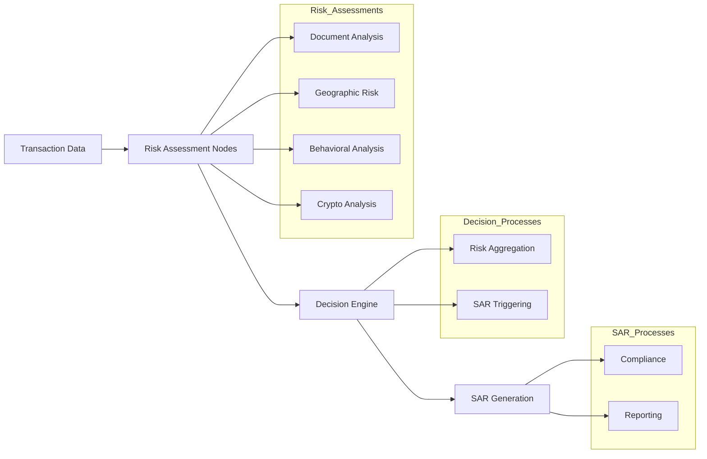

# 🛡️ AI-Powered Anti-Money Laundering Detection System

## Capstone Project Objective

The goal of this capstone project is to develop an advanced AI-powered Anti-Money Laundering (AML) detection system that can effectively identify and assess complex suspicious activities in financial transactions. The overall objective is to deliver a robust, scalable, and transparent solution leveraging state-of-the-art AI technologies and workflow orchestration to enhance AML processes within financial institutions. The intended outcome is a system capable of real-time detection, dynamic risk assessment, automated regulatory reporting, and comprehensive audit trails, ultimately supporting financial professionals in meeting compliance standards and proactively combating money laundering threats.

## 🎯 Problem Statement

The global financial ecosystem is under constant threat from highly sophisticated and evolving money laundering activities. Criminals now exploit advanced technologies and intricate financial channels to conceal the origins of illicit funds, making detection increasingly challenging. Traditional rule-based systems and manual review processes used by financial institutions are often inadequate at identifying complex schemes that span international borders, leverage digital assets, and hide behind layers of anonymity.

Key challenges faced by financial institutions include:
- **International Transfers**: Cross-border payments are used to move funds quickly through multiple jurisdictions, making tracing the source and destination of money difficult.
- **Cryptocurrencies**: The rise of decentralized digital assets and blockchain technology allows for rapid, pseudonymous movement of value, complicating transaction monitoring.
- **Shell Companies**: Illicit actors set up fictitious or opaque corporate structures to obscure true beneficial ownership, making it harder to link funds to criminal activities.
- **Complex Transaction Patterns**: Criminal networks orchestrate convoluted transaction flows—such as layering and integration—to evade standard detection rules.

Effectively addressing these threats requires an intelligent, adaptive, and scalable approach that leverages advanced AI technologies for real-time detection, dynamic risk assessment, and automated reporting, ensuring proactive compliance and robust protection against financial crime.

Our AI-powered AML detection system provides:
- **Intelligent Risk Assessment**: Multi-dimensional analysis using LLM reasoning
- **Dynamic Risk Routing**: Automated escalation for high-risk cases
- **Compliance Reporting**: Automated SAR (Suspicious Activity Report) generation
- **Full Traceability**: Complete audit trail using Langfuse
- **Performance Evaluation**: Model assessment via LangSmith
- **Interactive Dashboard**: Real-time visualization and monitoring

## 🏗️ System Architecture

### Overall System Architecture


The diagram above presents the high-level architecture of the AI-powered Anti-Money Laundering (AML) detection system. It shows the journey from ingesting raw transaction data, through specialized AI agents operating within a LangGraph-orchestrated workflow, all the way to regulatory compliance and continuous improvement.

- **Transaction Data Ingestion**: Starts with acquiring and preprocessing transaction data from financial systems.
- **Feature Extraction**: Important features are engineered to highlight behavioral, geographic, and transactional risk factors.
- **AI-Driven Multi-Agent Workflow**: The core engine (powered by LangGraph) coordinates specialized agents, each handling a focused analysis task:
  - **Transaction Screening Agent**: Flags initial suspicious activities and anomalies.
  - **Risk Assessment Agent**: Evaluates risk levels and calculates risk scores using LLM-based reasoning.
  - **Typology Classification Agent**: Classifies the typology of potential money laundering activities.
  - **SAR Generation Agent**: Prepares draft Suspicious Activity Reports for compliance review.
- **Compliance & Investigation**: Aggregates outputs from all agents for further internal investigation, review, and action.
- **Regulatory Compliance**: Ensures SAR filings, documentation, and follow-ups meet regulatory standards.
- **Continuous Feedback Loop**: Insights and feedback from compliance outcomes are fed back into the AI-driven workflow for ongoing learning and improvement.

### Core Components

1. **LangGraph Workflow Engine**: Orchestrates multi-agent collaboration and case routing.
2. **LLM-Powered Risk Agents**: Intelligent agents for transaction screening, risk assessment, typology, and SAR drafting.
3. **Dynamic Routing Logic**: Escalates high-risk or complex cases to the appropriate agents or human review.
4. **Observability Layer**: Integrated tracing and evaluation using Langfuse and LangSmith for transparency and model assessment.
5. **Reporting & Dashboard**: Automated SAR report generation and an interactive dashboard for real-time monitoring.

### Workflow Structure




### AML Detection Workflow Diagram


The workflow diagram above illustrates the complete AML detection process, showing:

- **Initial Screening**: Entry point for transaction analysis
- **Parallel Risk Assessment**: Multiple analysis paths including:
  - Geographic analysis
  - Document verification
  - Cryptocurrency analysis
  - Behavioral pattern detection
- **Enhanced Due Diligence (EDD)**: Additional checks for high-risk cases
- **PEP & Sanctions Screening**: Politically Exposed Person and sanctions checks
- **Risk Scoring**: Aggregated risk assessment
- **Decision Points**: SAR generation or human review based on risk levels
- **Final Output**: Suspicious Activity Reports or case closure

## 📁 Project Structure

```
Team_FinTrack_AI/
├── Step1_Setup                     # Environment setup & API configuration
├── Step2_Graph_Design             # Workflow structure & state design
├── Step3_LLM_Nodes                # LLM-powered risk assessment nodes
├── Step4_Routing_Logic            # Dynamic routing & decision logic
├── Step5_Tracing_Eval             # Langfuse & LangSmith integration
├── Step6_Evaluation               # Model performance assessment
├── Step7_Reporting                # Reporting & visualization
├── Final_Project                  # Integrated running application
├── sar_drafts/                    # Generated SAR PDFs/TXTs
├── aml_report.csv                 # Risk assessment results
├── aml_report_with_typology.csv   # Enhanced dataset with typologies
├── app.py                         # Streamlit dashboard
├── requirements.txt               # Dependencies
└── presentation_slides.pptx       # Final presentation
```

## 🚀 Quick Start

### Prerequisites

- Python 3.8+
- OpenAI API key
- Langfuse API key

### Installation

1. **Clone the repository**:
   ```bash
   git clone <repository-url>
   cd Team_FinTrack_AI
   ```

2. **Install dependencies**:
   ```bash
   pip install -r requirements.txt
   ```

3. **Configure environment variables**:
   ```bash
   cp capstone-template/env.example .env
   # Edit .env with your API keys
   ```

4. **Run the dashboard**:
   ```bash
   streamlit run app.py
   ```

## 🔧 Implementation Steps

### Step 1: Setup & Orientation (10 marks)
- ✅ Environment setup & API configuration
- ✅ Dependency installation (LangGraph, Langfuse, LangChain-OpenAI)
- ✅ API connectivity verification

### Step 2: Graph & State Design (15 marks)
- ✅ AML state object definition
- ✅ Placeholder nodes (Document, Geographic, Behavioral, Crypto)
- ✅ Working graph flow compilation
- ✅ Workflow visualization

### Step 3: LLM-Powered Risk Nodes (20 marks)
- ✅ OpenAI prompts for each node
- ✅ JSON responses with score + rationale
- ✅ Results storage in graph state

### Step 4: Dynamic Routing & Decision Logic (15 marks)
- ✅ Decision Engine node creation
- ✅ Risk score aggregation
- ✅ Risk classification (Low/Medium/High)
- ✅ SAR triggering for high-risk cases

### Step 5: Observability & Tracking (15 marks)
- ✅ Langfuse tracing spans
- ✅ Langfuse dataset uploads
- ✅ Dashboard verification

### Step 6: Evaluation & Scoring (15 marks)
- ✅ Evaluation rubric definition
- ✅ Risk alignment assessment
- ✅ Faithfulness and accuracy metrics
- ✅ Results logging to Langfuse & LangSmith

### Step 7: Reporting & Extensions (10 marks)
- ✅ CSV report generation
- ✅ Auto-generated SAR PDFs
- ✅ Typology classification (Structuring, Layering, Integration)
- ✅ Interactive dashboard

## 🎨 Dashboard Features

### Enhanced AML Detection Dashboard

- **🎨 Colorful UI**: Modern gradient design with custom CSS styling
- **📊 Interactive Charts**: Pie charts and bar graphs for data visualization
- **🏷️ Typology Badges**: Color-coded badges for different AML typologies
- **📈 Key Metrics**: Real-time KPIs including SAR rates and case counts
- **🔍 Advanced Filtering**: Filter by risk level, typology, and SAR status
- **📋 Detailed Analysis**: Comprehensive case-by-case analysis with visual indicators

### Typology Categories

| Typology | Color | Stage | Description |
|----------|-------|-------|-------------|
| STRUCTURING | 🔴 Red | Placement | Breaking down large transactions |
| LAYERING | 🟢 Teal | Layering | Complex transactions to obscure origin |
| INTEGRATION | 🔵 Blue | Integration | Reintroducing funds to legitimate economy |
| UNCLASSIFIED | ⚫ Gray | Unknown | Cases requiring further analysis |

## 📊 Key Features

### 1. **Multi-Agent Risk Assessment**
- Document analysis for transaction patterns
- Geographic risk assessment for high-risk countries
- Behavioral analysis for unusual patterns
- Cryptocurrency transaction monitoring

### 2. **Intelligent Decision Engine**
- Risk score aggregation from multiple sources
- Dynamic threshold-based routing
- Automated SAR triggering for high-risk cases
- Comprehensive audit trail

### 3. **Advanced Observability**
- Complete Langfuse tracing for all operations
- LangSmith integration for model evaluation
- Performance metrics and analytics
- Real-time monitoring capabilities

### 4. **Automated Reporting**
- SAR generation for high-risk cases
- Typology classification and rationale
- Comprehensive risk assessment reports
- Interactive dashboard for monitoring

## 🔍 Usage Examples

### Running Risk Assessment
```python
# Initialize the AML detection system
from aml_detection import AMLDetectionSystem

system = AMLDetectionSystem()
result = system.analyze_transaction(transaction_data)
```

### Dashboard Navigation
1. **Filters**: Use filter controls to narrow down cases
2. **Metrics**: View key performance indicators
3. **Charts**: Analyze typology distribution and risk patterns
4. **Case Analysis**: Review detailed case information
5. **SAR Summary**: Focus on cases requiring SAR filing

## 📈 Evaluation Metrics

### Performance Assessment
- **Risk Alignment**: Accuracy of risk level classification
- **Faithfulness**: Consistency of LLM reasoning
- **Accuracy**: Correct identification of suspicious activities
- **SAR Effectiveness**: Quality of generated reports

### Key Performance Indicators
- Total cases processed
- SAR filing rate
- Typology distribution
- Risk level accuracy
- Processing time per case

## 🛠️ Technical Stack

- **LangGraph**: Multi-agent workflow orchestration
- **OpenAI GPT**: LLM-powered risk assessment
- **Langfuse**: Observability and tracing plus Model evaluation and monitoring
- **Streamlit**: Interactive dashboard
- **Pandas**: Data processing and analysis
- **Plotly**: Interactive visualizations

## 📋 Data Requirements

The system expects CSV files with the following columns:
- `Scenario`: Description of the AML scenario
- `Overall Score`: Risk score (0-100)
- `Level`: Risk level classification
- `SAR`: Boolean indicating if SAR is required
- `Alerts`: List of triggered alerts
- `Typology`: AML typology classification
- `Typology Rationale`: Detailed explanation of classification

## 🎯 Advanced Extensions (Bonus Features)

- **Streamlit Dashboard**: Interactive filters and SAR alerts
- **Enhanced SAR Reports**: Formatted metadata and timestamps
- **Typology Classifier**: Additional typologies beyond the core three
- **Real-time Monitoring**: Live transaction analysis
- **API Integration**: RESTful endpoints for external systems

## 📊 Results & Insights

### Key Statistics
- **Total Cases**: Comprehensive analysis of transaction patterns
- **SAR Rate**: Percentage of cases requiring suspicious activity reports
- **Typology Distribution**: Breakdown of money laundering typologies
- **Risk Assessment**: Automated risk level determination

### Money Laundering Stage Analysis
- **Placement**: Initial introduction of illicit funds
- **Layering**: Complex transactions to obscure origin
- **Integration**: Reintroduction to legitimate economy

## 🏆 Project Outcomes

This capstone project delivers:
1. **Modular AML System**: Flexible, scalable architecture
2. **LLM-Driven Analysis**: Intelligent risk assessment using AI
3. **Full Traceability**: Complete audit trail and monitoring
4. **Professional Reporting**: Automated SAR generation
5. **Interactive Dashboard**: Real-time visualization and monitoring

## 📚 Documentation

- **Phase Notebooks**: Detailed implementation for each phase
- **API Documentation**: Complete reference for all endpoints
- **User Guide**: Step-by-step usage instructions
- **Architecture Guide**: System design and component overview

## 🤝 Team Collaboration

This project was developed as a team effort with:
- **Modular Development**: Each phase implemented independently
- **Version Control**: Git-based collaboration and tracking
- **Code Review**: Peer review process for quality assurance
- **Documentation**: Comprehensive documentation for all components

## 📞 Support & Contact

For questions or support regarding this project:
- Review the phase notebooks for implementation details
- Check the dashboard documentation for usage instructions
- Refer to the API documentation for technical details

## 📄 License

This project is developed as part of the AI-Powered AML Detection Capstone Project. Please refer to the LICENSE file for usage terms and conditions.

---

**Note**: This project is part of an academic capstone assignment focused on developing AI-powered Anti-Money Laundering detection systems using advanced LLM orchestration frameworks.